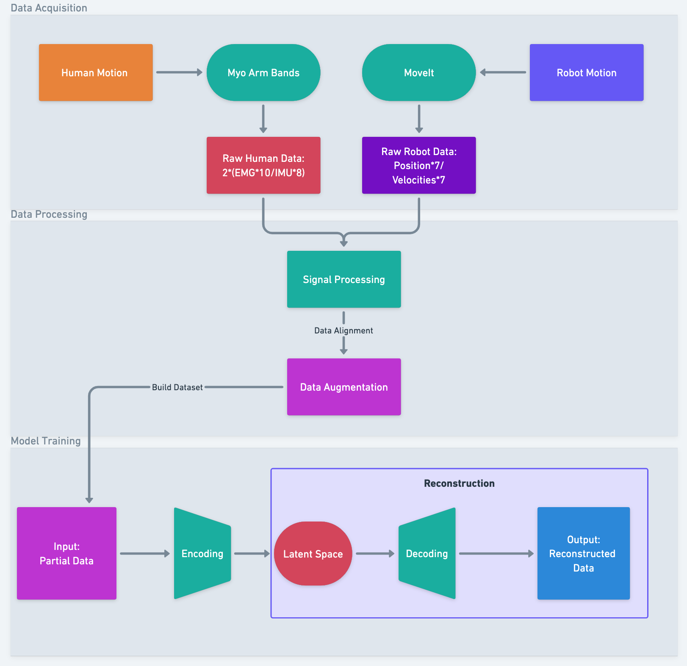
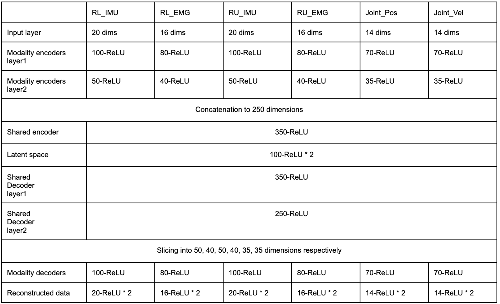
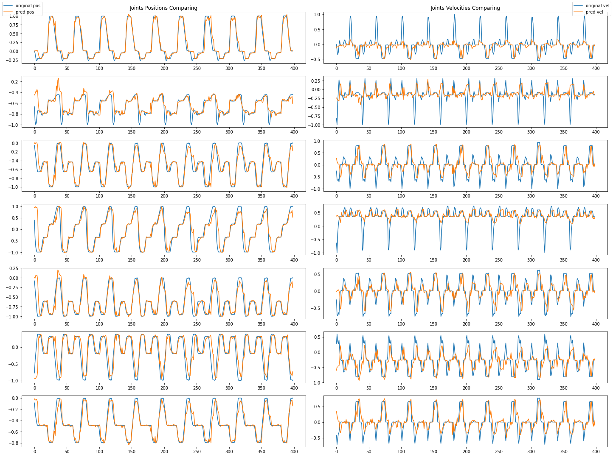

# human_robot_signal_retargeting

* Haozhi Zhang
* MSR Final Project  
* [Portfolio Post](https://jameszhz1647.wixsite.com/haozhizhang/general-8)
* [Human Data Acquisition](https://github.com/jameszhz1647/connect_myo/tree/human_data_acquisition_clean)
* [Robot Data Acquisition](https://github.com/jameszhz1647/RobotArmOutput/tree/robot_data_acquisition_clean)

## Overview

The goal of this project is to predict robot motion by monitoring human motion using a cross-domain multimodal variational autoencoder (mVAE) model. The human motion contains two type of electronic signal: electromyography (EMG) and inertial measurement unit (IMU), collecting by Myo arm band. The robot motion contains the positions and velocities of 7 joints of Franka pandas arm, collecting by the simulation in ROS MoveIt. This project applies signal processing and data augmentation on the acquisited huamn/robot data to build the dataset. The mVAE model is adapted from the paper [Multimodal representation models for prediction and control from partial information](https://www.sciencedirect.com/science/article/pii/S0921889019301575).

## Pipeline

1. ##### Data Acquisition:

   - Design 5 tasks: each task contains 4 segments:	
     1. move arm from home position to object (differnt initial position: degree 0, 45, 90, 135, 180 CCW from right for 5 task respectively)
     2. pick right up the object
     3. move the object radially away from initial position 
     4. move back to home position 
   - Perform each task for 10 repeats
   - Collect raw emg/imu data from two Myo arm band: details in Human Data Acquisition
   - Collect raw robot data from ROS MoveIt: details in Robot Data Acquisition

2. ##### Data Processing:

   1. post_processing: signal post-processing for both raw data collected from human and robot. 

      1. For human: downsampling (decimate) both EMG/IMU to the rate at 10 Hz
      2. For robot: downsampling (decimate) one segment of datapoints to 8 points, add 2 static points at the end of each segment. Integrate 4 segments into single sequence. 
      3. Concatenate 10 repeats for both human and robot data, and then align them to obtain the original dataset.

   2. data_augmentation: apply augmentaion on original dataset in order to train the mVAE model

      1. Using sklearn.preprocessing.MinMaxScaler to normailize the original data to the range at [-1, 1]

      2. Horizontally concatenate all data points at current time (at t) with them at previous time (at t -1)

      3. Split dataset into training set and testing set at ratio of 80:20

      4. Mask all robot data in training set with value -2 to obtain the case 2 dataset; mask all original data at t in training set with value -2  to obtain case 3 dataset

      5. Vertically concatenate original data with case 2 and case 3 data to obtain the final augmented training set depicted below:

         | Case | RL_IMU_t | RL_IMU_t-1 | RL_EMG_t | RL_EMG_t-1 | RU_IMU_t | RU_IMU_t-1 | RU_EMG_t | RU_EMG_t-1 | Pos_t  | Pos_t-1 | Vel_t  | Vel_t-1 |
         | ---- | -------- | ---------- | -------- | ---------- | -------- | ---------- | -------- | ---------- | ------ | ------- | ------ | ------- |
         | 1    |          |            |          |            |          |            |          |            |        |         |        |         |
         | 2    |          |            |          |            |          |            |          |            | Masked | Masked  | Masked | Masked  |
         | 3    | Masked   |            | Masked   |            | Masked   |            | Masked   |            | Masked |         | Masked |         |

         

3. ##### Model Training:

   - Train the multimodal variational autoencoder (mVAE) model by feeding augmented dataset.
   - The network implemented consists of 6 unimodal subnetwork. each subnetwork has their own encoder and decoder, but they share their weights in shared encoder, latent space and shared decoder. Details explained in Model section. 

## Folders

- ##### raw_data:

   - **human_**: including 5 tasks, each task contains 2 EMG and 2 IMU signals, corresponding to upper-right arm and lower-right arm.

   - **robot_**: including 5 sub folders: each folder corresponding to one task, contains 4 segments, each segment has positions and  velocities of 7 joints.

- ##### data_processing: 

   - **build_dataset.ipynb**: singal post-processing for both raw data collected from human and robot and apply augmentaion on original dataset in order to train the mVAE model.

- ##### dataset:

   - **original_data_with_cur_prev.csv**: (1999 rows * 100 cols)
      1. Collected original data from human motion and robot motion, then align them with the same time stamp in one row. 
      2. Concatenate the datapoint at current time (at t) with the datapoint at previous time (at t-1) in one row. 
   - **raw_training_data.csv**: (1599 rows * 100 cols) randomly split 80% portion from original_data_with_cur_prev.csv
   - **testing_data.csv**: (400 rows * 100 cols) randomly split 20% portion from original_data_with_cur_prev.csv
   - **final_aug_training_data.csv**: (4797 rows * 200 cols) augmented the data from raw_training_data.csv
      1. Normalize data for each columns within the range [-1, 1]
      2. Vertically concatenate the original training data with two more cases: (4797 rows * 100 cols)
         1. Masked robot data
         2. Masked data at time t
      3. Horizontally concatenate augmented  data with original training data (4797 rows * 200 cols)

- ##### model:

   - **mvae_model_train_test.ipynb**: train the model and use the trained to test and visualize the performance of prediction (reconstruction)

## Model

- ##### Network Architecture:

  

- **Training Parameters**:
  - learning rate: 0.00005
  - batch size: 1000
  - optimizer: Adam
  - training epochs: 80000
- **Performance Testing:** (metric: MSE)
  - Test 1: predict (reconstruct) robot data from complete original data: 
  - **Test 2: predict (reconstruct) robot data from human data only:**
  - Test 3: predict (reconstruct) all data at t from all data at t- 1 only:
  - **Test 4:  predict (reconstruct) future robot data (at t + 1) from human data only:** 
    1. Feed the huamn data only, to predict (reconstruct) the complete data
    2. Feed  the data at t only from the previous reconstructed data again, now predict the future robot data (at t + 1)

## Result

- ##### Performance on each test (metric: MSE)

  |                           | Test 1 | Test 2 | Test 3 | Test 4 (at t+1) |
  | ------------------------- | ------ | ------ | ------ | --------------- |
  | **Joints_pos_cur (at t)** | 0.0067 | 0.0285 | 0.0061 | 0.0352          |
  | **Joints_vel_cur (at t)** | 0.0356 | 0.0514 | 0.0362 | 0.0671          |

- ##### Plots for test 4: comparing the original pos/vel at t with predicted pos/vel at t + 1

	

## Future Work

Based on the testing result, it can be concluded that our model is able to predict or reconstructed the future robot state by given current human state. For the model training, exploration in tuning network architecture is worthing, since the current one is just an analogy to the ratio of the model in paper. A better strategy on usage of latent loss could be a next approach to improve the prediction performance. Additionally, the model deployment on ROS to enable a live control of robot arm will be the significant stage in future. This implementation should carefully deal with the signal processing in real time, including normalization and frequency reduction. If the kinematic works well, the dynamics of robot arm, like torque, gripper force could be added as new modalities to the network. 